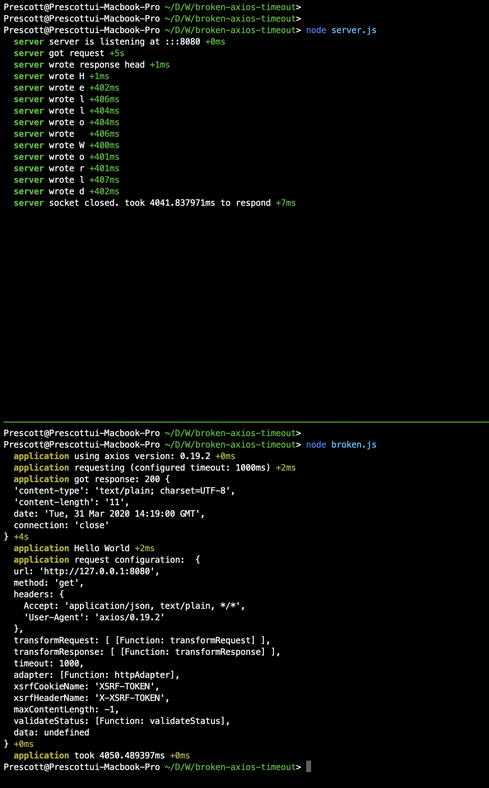
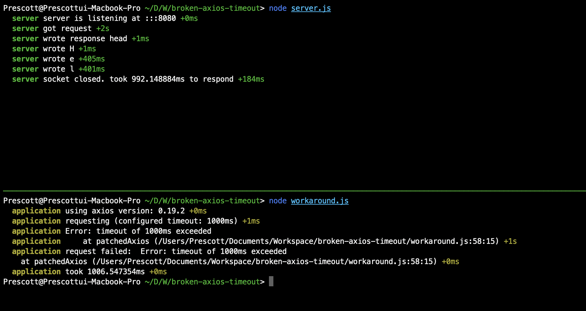

# broken-axios-timeout

An example application to reproduce broken timeout handling of axios

## Proofs

#### Broken



#### Workaround



## Affected axios versions

- v0.19.1
- v0.19.2 

## The issue

Currently, axios does not handle **Read Timeout** properly,
which results to exceed given timeout.   

- See: https://github.com/axios/axios/issues/2710
- Caused by: https://github.com/axios/axios/pull/1752

This issue was caused by improper timeout handling.

axios PR #1732 removed internal timer which tracks read timeouts.

So for now, axios only relies to [`HTTPRequest#setTimeout`](https://nodejs.org/api/http.html#http_request_settimeout_timeout_callback), which calls [`Socket#setTimeout`](https://nodejs.org/api/net.html#net_socket_settimeout_timeout_callback) internally.
Unfortunately, [`Socket#setTimeout`](https://nodejs.org/api/net.html#net_socket_settimeout_timeout_callback) only tracks "socket inactivity". socket timer will be reset if any socket activity were detected.

according to documentation:

> [...]
>
> Sets the socket to timeout after timeout milliseconds of inactivity on the socket. By default net.Socket do not have a timeout.
>
> When an idle timeout is triggered the socket will receive a 'timeout' event but the connection will not be severed. The user must manually call socket.end() or socket.destroy() to end the connection.
>
> [...]

so, given socket timeout is 1000ms and server sends packets per each 800ms, socket won't trigger `timeout` event.


## Temporal workaround

Luckily, We can handle read timeouts by wrapping axios function:

```typescript
// Quick-and-dirty solution for read-timeout issue
// @see https://github.com/axios/axios/issues/2710
async function patchedAxios<T>(options: AxiosRequestConfig): Promise<AxiosResponse<T>> {
  if (options.timeout) {
    const cancelSource = axios.CancelToken.source();
    const readTimeoutTimer = setTimeout(() => {
      cancelSource.cancel(`timeout of ${options.timeout}ms exceeded`);
    }, options.timeout);

    try {
      return await axios({
        ...options,
        cancelToken: cancelSource.token,
      });
    } catch (e) {
      if (axios.isCancel(e)) {
        throw new Error(e.message);
      }

      throw e;
    } finally {
      clearTimeout(readTimeoutTimer);
    }
  } else {
    return axios(options);
  }
}
``` 


## Running reproducible demo 

```bash
$ git clone https://github.com/mooyoul/broken-axios-timeout.git
$ cd broken-axios-timeout
$ npm ci
$ # Run test server first
$ node server.js
$ # and then, run test scripts
$ node broken.js
$ node workaround.js
```

